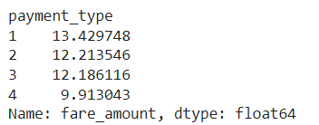

# Project: New York City Taxi Fare Prediction

The New York City Taxi and Limousine Commission seeks a way to utilize the data collected from the New York City area to predict the fare amount for taxi cab rides. The project comprises five notebooks, each focusing on a different aspect of the data analysis process.

- Notebook 1 - Inspect and Analyze Data: Investigates and understands the provided taxi cab dataset, including creating a pandas dataframe, performing a cursory inspection, and compiling summary information about the data.

- Notebook 2 - Exploratory Data Analysis: Conducts exploratory data analysis on the dataset, including data cleaning, building visualizations, and evaluating and sharing results.

- Notebook 3 - Hypothesis Testing: Demonstrates knowledge of hypothesis testing by analyzing whether there is a relationship between payment type and fare amount, using descriptive statistics and hypothesis testing in Python.

- Notebook 4 - Multiple Linear Regression Model: Builds a multiple linear regression model to predict fare amount, evaluating model performance and interpreting results.

- Notebook 5 - Random Forest and XGBoost Models: Implements Random Forest and XGBoost models to predict whether a customer is a generous tipper, considering ethical implications and recommending adjustments to the model objective if necessary.

Each notebook plays a crucial role in understanding the data, conducting analysis, building models, and providing insights regarding fare prediction and customer tipping behavior in New York City taxi cab rides.

# Notebook 1: Data Inspection and Analysis

### Data Overview

- The `fare_amount` values exhibit a wide range, including negative values, indicating potential data errors.
- Similarly, the `tip` column contains extremely high values, which may also be erroneous.
- Trip distances vary, with most rides falling within the 1-3 mile range, but some outliers extend beyond 33 miles.

### Data Quality Issues

- Errors are evident in the data, as indicated by negative `total_amount` values, suggesting potential data entry mistakes.

### Insights

- Key variables for building a predictive model for taxi fare include `total_amount` and `trip_distance`, which provide insights into the nature of taxi rides.

# Notebook 2: Exploratory Data Analysis (EDA)

### Trip Characteristics Analysis

- **Insights**: The majority of trips were short journeys of less than two miles, with a steep decline in the number of trips as distance traveled increases. This suggests that most taxi rides in the dataset were relatively short in duration.

<table>
  <tr>
    <td></td>
    <td></td>
  </tr>
</table>

- **Distribution Analysis**: Both the total cost and tip amount distributions are right-skewed, with most costs falling in the $5-15 range and nearly all tips in the $0-3 range. There are no significant differences in tip distributions between vendors, even at higher tip amounts.

### Passenger Count and Ride Frequency

<table>
  <tr>
    <td></td>
    <td></td>
  </tr>
</table>

- **Findings**: Most rides were single occupancy, with nearly 3% of rides having as many as six passengers. However, there were also 33 rides with a passenger count of zero, which is unusual and may need further investigation.

- **Tip Amount Variation**: Mean tip amount varies minimally by passenger count, although there is a slight drop for four-passenger rides. This drop is expected given the lower frequency of rides with four passengers.

### Temporal Analysis

- **Daily and Monthly Ride Patterns**: Wednesday through Saturday saw the highest number of daily rides, while Sunday and Monday had the fewest. Thursday had the highest gross revenue, despite having only slightly more rides than Saturday.

- **Seasonal Trends**: Monthly rides and revenue follow consistent patterns, with notable dips in the summer months (July, August, September) and one in February.

### Geographic Analysis

<table>
  <tr>
    <td></td>
    <td></td>
  </tr>
</table>

- **Location Density**: Drop-off locations exhibit a characteristic curve related to the cumulative density function of a normal distribution, indicating relatively even distribution across terrain. However, a disproportionate number of locations receive the majority of traffic, likely near popular tourist attractions, airports, and transportation terminals.

### Limitations and Further Investigation

- **Data Limitations**: The dataset lacks geographic coordinates for drop-off locations, limiting the ability to analyze location-specific patterns.
- **Opportunities for Further Analysis**: Investigating the reason behind rides with zero passengers and exploring the specific locations corresponding to high-traffic drop-off points could provide valuable insights into taxi ride patterns in the New York City area.

This exploratory analysis provides a comprehensive understanding of the characteristics and patterns within the taxi ride dataset, laying the groundwork for further analysis and modeling in subsequent notebooks.

# Notebook 3: Hypothesis testing

### Hypothesis and Test Results

- **Null Hypothesis ($H_0$)**: There is no difference in the average fare amount between customers who use credit cards and customers who use cash.
- **Alternative Hypothesis ($H_A$)**: There is a difference in the average fare amount between customers who use credit cards and customers who use cash.
- **Test Result**: The obtained p-value is extremely low, much lower than the significance level. Thus, the test rejects the null hypothesis, indicating that the difference between the means of the fare amounts by payment type is statistically significant.

### Business Insight

- The key business insight is that encouraging customers to pay with credit cards can generate more revenue for taxi cab drivers.

### Realism of the A/B Project

- This A/B project might not be realistic in a commercial setting due to limitations in data collection and necessary assumptions. The main assumption is that passengers were forced to pay one way or the other, which may not necessarily reflect reality. Additionally, other likely explanations are not considered, such as passenger preference for payment method based on fare amount.

This analysis provides valuable insights into how payment method can impact taxi drivers' revenues, but also highlights the limitations and necessary assumptions in conducting A/B testing projects in a real-world setting.

# Notebook 4: Multiple Linear Regression Model

## Outlier Analysis and Data Preprocessing

### Outliers Detection:

- All three variables (fare_amount, trip_distance, and trip_duration) contain outliers, with some being extreme.
- While trip_distance values of 30 miles may seem unusual, they are plausible given the dataset's context.
- Zero or negative values for fare_amount and trip_duration are problematic and need to be addressed.

### Handling Outliers:
- Negative values for fare_amount and trip_duration are replaced with zeros.
- High-end outliers for fare_amount and trip_duration are capped to reduce their impact on the model.

## Feature Engineering and Selection

### New Feature Creation:
- Created mean_distance and mean_duration columns to capture the mean trip distance and duration for each pickup and dropoff location.

### Correlation Analysis:

- The mean_distance and mean_duration features are strongly correlated with fare_amount, indicating their predictive power.
- Despite their correlation, both features are included in the model to improve predictive accuracy.

## Model Building and Evaluation

### Model Performance:
- The multiple linear regression model achieved an R^2 score of 0.868, indicating a good fit to the data.
- Mean Absolute Error (MAE) and Root Mean Squared Error (RMSE) were calculated to assess model accuracy.

### Coefficients Interpretation:

- Coefficients analysis revealed that mean_distance had the greatest weight in predicting fare_amount.
- Standardized coefficients were interpreted to understand the impact of each feature on fare_amount.
- The division of the model coefficient by the standard deviation of the mean_distance feature provides insight into how a one standard deviation change in mean_distance impacts the fare amount, allowing for a more intuitive interpretation in the original unit of distance.

## Key Takeaways
- Multiple linear regression is effective in estimating fare_amount from various independent variables.
- Exploratory data analysis aids in selecting relevant features for regression modeling.
- Model evaluation and interpretation help assess predictive accuracy and feature importance.

## Results Presentation
- Linear regression assumptions were met, and model performance was evaluated using MAE and RMSE scores.
